# CodeForge Academy — ERD v2.0

> Derived from **SRS v2.0** | June 2026  
> 17 tables · 6 domains · PostgreSQL

---

## Domain Map

| Domain | Tables |
|---|---|
| 🔐 Identity & Auth | `users`, `password_reset_tokens` |
| 📚 Course Structure | `courses`, `course_instructors`, `sections`, `lectures`, `resources` |
| 📋 Enrollment Flow | `enrollment_requests`, `enrollments` |
| 🎓 Learning & Progress | `quizzes`, `quiz_questions`, `quiz_options`, `quiz_attempts`, `quiz_answers`, `lecture_progress`, `live_sessions` |
| 📣 Communication | `announcements`, `leads` |
| 🔍 System Observability | `activity_logs` |

---

## Full ERD

```mermaid
erDiagram

    %% ─────────────────────────────────────────
    %% IDENTITY & AUTH
    %% ─────────────────────────────────────────

    users {
        UUID id PK
        VARCHAR_255 email "UNIQUE NOT NULL"
        VARCHAR_255 password_hash "NOT NULL"
        VARCHAR_255 full_name "NOT NULL"
        VARCHAR_20  phone
        VARCHAR_20  role "admin|instructor|student"
        BOOLEAN     is_active "DEFAULT true"
        BOOLEAN     must_change_password "DEFAULT false"
        TIMESTAMPTZ created_at
        TIMESTAMPTZ updated_at
        TIMESTAMPTZ deleted_at
    }

    password_reset_tokens {
        UUID        id PK
        UUID        user_id FK
        VARCHAR_255 token "UNIQUE NOT NULL"
        TIMESTAMPTZ expires_at "NOT NULL"
        TIMESTAMPTZ used_at
        TIMESTAMPTZ created_at
    }

    %% ─────────────────────────────────────────
    %% COURSE STRUCTURE
    %% ─────────────────────────────────────────

    courses {
        UUID         id PK
        VARCHAR_255  title "NOT NULL"
        VARCHAR_255  slug "UNIQUE NOT NULL"
        TEXT         description
        VARCHAR_500  thumbnail_url
        VARCHAR_100  category
        NUMERIC_10_2 price "DEFAULT 0"
        VARCHAR_10   currency "DEFAULT EGP"
        VARCHAR_20   status "draft|published|archived"
        UUID         created_by FK
        TIMESTAMPTZ  created_at
        TIMESTAMPTZ  updated_at
        TIMESTAMPTZ  deleted_at
    }

    course_instructors {
        UUID        id PK
        UUID        course_id FK
        UUID        instructor_id FK
        TIMESTAMPTZ assigned_at
    }

    sections {
        UUID        id PK
        UUID        course_id FK
        VARCHAR_255 title "NOT NULL"
        INT         order_index "NOT NULL"
        TIMESTAMPTZ created_at
        TIMESTAMPTZ updated_at
    }

    lectures {
        UUID        id PK
        UUID        section_id FK
        VARCHAR_255 title "NOT NULL"
        VARCHAR_500 youtube_url
        TEXT        description
        INT         order_index "NOT NULL"
        INT         duration_minutes
        TIMESTAMPTZ created_at
        TIMESTAMPTZ updated_at
    }

    resources {
        UUID        id PK
        UUID        lecture_id FK "nullable"
        UUID        section_id FK "nullable"
        VARCHAR_255 title "NOT NULL"
        VARCHAR_500 file_url "NOT NULL"
        VARCHAR_20  file_type "pdf|ppt|zip|other"
        INT         file_size_kb
        TIMESTAMPTZ created_at
        TIMESTAMPTZ updated_at
    }

    %% ─────────────────────────────────────────
    %% ENROLLMENT FLOW
    %% ─────────────────────────────────────────

    enrollment_requests {
        UUID        id PK
        VARCHAR_255 applicant_name "NOT NULL"
        VARCHAR_255 applicant_email "NOT NULL"
        VARCHAR_20  applicant_phone
        UUID        course_id FK
        VARCHAR_100 payment_method "NOT NULL"
        VARCHAR_500 payment_proof_url "NOT NULL"
        VARCHAR_20  status "pending|approved|rejected"
        TEXT        rejection_reason
        UUID        reviewed_by FK "nullable → users.id"
        TIMESTAMPTZ reviewed_at
        TIMESTAMPTZ created_at
        TIMESTAMPTZ updated_at
    }

    enrollments {
        UUID        id PK
        UUID        student_id FK
        UUID        course_id FK
        UUID        source_request_id FK "nullable"
        VARCHAR_20  status "active|expired"
        TIMESTAMPTZ access_expires_at
        TIMESTAMPTZ created_at
        TIMESTAMPTZ updated_at
    }

    %% ─────────────────────────────────────────
    %% LEARNING & PROGRESS
    %% ─────────────────────────────────────────

    lecture_progress {
        UUID        id PK
        UUID        student_id FK
        UUID        lecture_id FK
        TIMESTAMPTZ completed_at
    }

    quizzes {
        UUID        id PK
        UUID        course_id FK
        VARCHAR_255 title "NOT NULL"
        INT         time_limit_minutes
        INT         pass_score "0-100"
        BOOLEAN     allow_retake "DEFAULT true"
        TIMESTAMPTZ created_at
        TIMESTAMPTZ updated_at
    }

    quiz_questions {
        UUID id PK
        UUID quiz_id FK
        TEXT question_text "NOT NULL"
        INT  order_index "NOT NULL"
    }

    quiz_options {
        UUID        id PK
        UUID        question_id FK
        VARCHAR_500 option_text "NOT NULL"
        BOOLEAN     is_correct "DEFAULT false"
    }

    quiz_attempts {
        UUID        id PK
        UUID        quiz_id FK
        UUID        student_id FK
        INT         score
        BOOLEAN     passed
        TIMESTAMPTZ started_at
        TIMESTAMPTZ submitted_at
    }

    quiz_answers {
        UUID id PK
        UUID attempt_id FK
        UUID question_id FK
        UUID selected_option_id FK "nullable"
    }

    live_sessions {
        UUID        id PK
        UUID        course_id FK
        UUID        instructor_id FK
        VARCHAR_255 title "NOT NULL"
        TEXT        description
        VARCHAR_500 session_url "NOT NULL"
        TIMESTAMPTZ scheduled_at "NOT NULL"
        TIMESTAMPTZ created_at
        TIMESTAMPTZ updated_at
    }

    %% ─────────────────────────────────────────
    %% COMMUNICATION
    %% ─────────────────────────────────────────

    announcements {
        UUID        id PK
        UUID        course_id FK "nullable = platform-wide"
        UUID        author_id FK
        VARCHAR_255 title "NOT NULL"
        TEXT        body "NOT NULL"
        TIMESTAMPTZ created_at
        TIMESTAMPTZ updated_at
    }

    leads {
        UUID        id PK
        VARCHAR_255 name "NOT NULL"
        VARCHAR_255 email "NOT NULL"
        VARCHAR_20  phone
        TEXT        message
        BOOLEAN     is_contacted "DEFAULT false"
        TIMESTAMPTZ created_at
    }

    %% ─────────────────────────────────────────
    %% SYSTEM OBSERVABILITY
    %% ─────────────────────────────────────────

    activity_logs {
        UUID        id PK
        UUID        user_id FK
        VARCHAR_100 action "logged_in|completed_lecture|..."
        VARCHAR_100 entity_type
        UUID        entity_id
        JSONB       metadata
        TIMESTAMPTZ created_at
    }

    %% ─────────────────────────────────────────
    %% RELATIONSHIPS
    %% ─────────────────────────────────────────

    %% Auth
    users                ||--o{ password_reset_tokens   : "requests"
    users                ||--o{ activity_logs            : "generates"

    %% Course ownership & assignment
    users                ||--o{ courses                  : "creates (created_by)"
    users                ||--o{ course_instructors       : "is assigned as instructor"
    courses              ||--o{ course_instructors       : "has instructors"

    %% Course content hierarchy
    courses              ||--o{ sections                 : "has"
    sections             ||--o{ lectures                 : "contains"
    lectures             ||--o{ resources                : "has (lecture-level)"
    sections             ||--o{ resources                : "has (section-level)"

    %% Enrollment flow
    courses              ||--o{ enrollment_requests      : "targeted by"
    users                ||--o{ enrollment_requests      : "reviewed by (admin)"
    enrollment_requests  ||--o| enrollments              : "leads to (on approval)"
    users                ||--o{ enrollments              : "student enrolled in"
    courses              ||--o{ enrollments              : "enrolled via"

    %% Learning & Progress
    users                ||--o{ lecture_progress         : "student tracks"
    lectures             ||--o{ lecture_progress         : "tracked by"

    courses              ||--o{ quizzes                  : "has"
    quizzes              ||--o{ quiz_questions            : "contains"
    quiz_questions       ||--o{ quiz_options              : "has options"
    quizzes              ||--o{ quiz_attempts             : "attempted in"
    users                ||--o{ quiz_attempts             : "student makes"
    quiz_attempts        ||--o{ quiz_answers              : "records"
    quiz_questions       ||--o{ quiz_answers              : "answered in"
    quiz_options         ||--o{ quiz_answers              : "selected as"

    courses              ||--o{ live_sessions             : "has"
    users                ||--o{ live_sessions             : "instructor schedules"

    %% Communication
    courses              ||--o{ announcements             : "has (nullable=platform-wide)"
    users                ||--o{ announcements             : "author posts"
```



---

## Key Design Notes

### 🔗 Cardinality Legend
| Notation | Meaning |
|---|---|
| `||--o{` | One-to-many (mandatory left, optional-many right) |
| `||--o|` | One-to-one-or-zero (enrollment request → enrollment) |

### 📌 Notable Design Decisions

| Decision | Rationale |
|---|---|
| `enrollment_requests` ≠ `enrollments` | Clean separation: request = approval workflow; enrollment = access record |
| `resources.lecture_id` OR `section_id` | CHECK constraint enforces at least one; enables section-level resource libraries |
| `announcements.course_id` nullable | NULL = platform-wide; non-null = course-scoped |
| `courses.slug` UNIQUE + indexed | URL-safe routing in Next.js `/courses/[slug]`; never auto-updated after creation |
| `activity_logs` append-only | No UPDATE/DELETE endpoints; `metadata JSONB` for flexible context |
| `enrollments` UNIQUE(student_id, course_id) | Prevents duplicate active enrollments per course |
| `lecture_progress` UNIQUE(student_id, lecture_id) | Idempotent completion marking |
| `courses.price` NUMERIC(10,2) | Avoids floating-point rounding on financial data |
| `users.deleted_at` soft-delete | Preserves audit trail; EF Core global query filter |

### 🏝️ Standalone Tables (No FK)
- **`leads`** — Public contact form submissions; not linked to any user account by design.

### ⚡ Suggested Indexes (beyond PKs/UKs)
```sql
-- Frequent query patterns
CREATE INDEX idx_courses_status       ON courses(status);
CREATE INDEX idx_courses_slug         ON courses(slug);
CREATE INDEX idx_enrollments_student  ON enrollments(student_id);
CREATE INDEX idx_enrollments_status   ON enrollments(status);
CREATE INDEX idx_activity_logs_user   ON activity_logs(user_id);
CREATE INDEX idx_activity_logs_action ON activity_logs(action);
CREATE INDEX idx_enr_req_status       ON enrollment_requests(status);
CREATE INDEX idx_enr_req_email        ON enrollment_requests(applicant_email);
-- Future analytics
CREATE INDEX idx_activity_logs_meta   ON activity_logs USING GIN(metadata);
```
